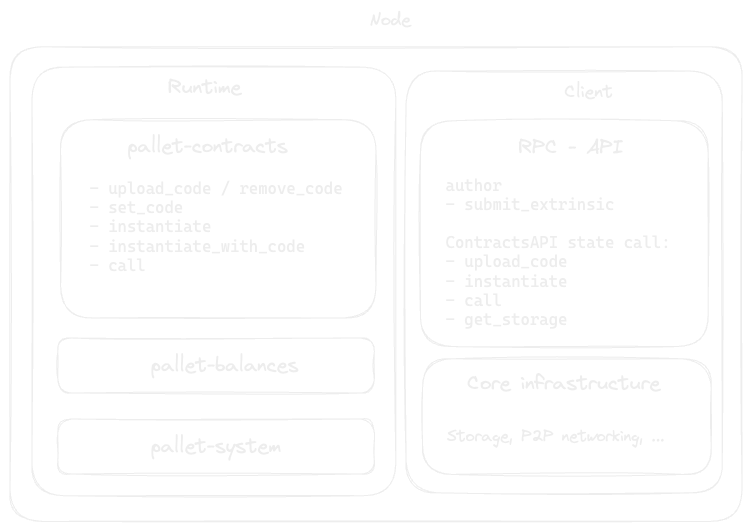
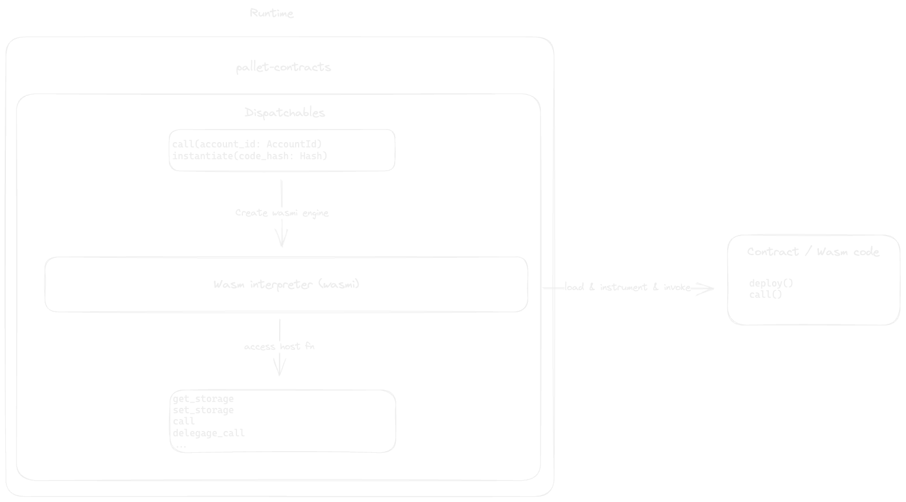

# Integrate pallet-contracts into a blockchain

PG / @pg:matrix.parity.io / @pgherveou

---

# Agenda

- pallet-contract:
  - Architecture
  - Dispatchables, Runtime API, Config
<br>

- Demo:
  - Integrate `pallet-contracts` from a node template
  - Create an deploy a smart contract that interact with the chain using call-runtime and chain extensions

Notes:

We will start by looking at the overall architecture of a blockchain configured with `pallet-contracts`, and then dive into the different parts that of the pallet. We will look at the Dispatchables and the Runtime API exposed by the pallets, the things that you manipulate from the UI or the cli with cargo-contract and also at the general configuration of the pallet.

Finally, we will put that theory in practice by taking a node template, configuring it with `pallet-contracts` and writing and deploying a simple smart contract.
To make thinks a little more interesting, instead of the traditional `flipper` example, we will build a simple "faucet" smart contract that interacts with pallet-assets, using runtime call and chain extensions

---

# Meet The Team

<div class="avatars" style="display: flex; justify-content: space-around; flex-wrap: wrap;">
    <div>
        
        <p>Alex</p>
    </div>
    <div>
        
        <p>Cyrill</p>
    </div>
    <div>
        
        <p>Sasha</p>
    </div>
    <div>
        
        <p>Juan</p>
    </div>
    <div>
        
        <p>PG</p>
    </div>
</div>

Notes:

We are currently a team of 5 people working on `pallet-contracts` at Parity. If you have been following, you probably know Alex who has been leading the project from the early days.
Cyrill has been in the the team for over a year, he focuses on Solang, a Solidity compiler, to compile your contracts written with Solidity to produce WASM that can be executed by pallet-contracts
Sasha has also been in the team for a year, focusing more on the internal. Juan and myself graduated from the last batch of the Polkadot Academy in Buenos Aires this year and both joined 2 months ago.

---

# ink!less

```lisp
(module
 (import "seal0" "call_runtime" (func $call_runtime (param i32 i32) (result i32)))
 (import "seal0" "seal_input" (func $seal_input (param i32 i32)))
 (import "seal0" "seal_return" (func $seal_return (param i32 i32 i32)))
 (import "env" "memory" (memory 1 1))

 ;; 0x1000 = 4k in little endian
 ;; size of input buffer
 (data (i32.const 0) "\00\10")

 (func (export "deploy"))
 
 (func (export "call")
  ;; Receive the encoded call
  (call $seal_input
   (i32.const 4) ;; Pointer to the input buffer
   (i32.const 0) ;; Size of the length buffer
  )
  ;; Just use the call passed as input and store result to memory
  (i32.store (i32.const 0)
   (call $call_runtime
    (i32.const 4)    ;; Pointer where the call is stored
    (i32.load (i32.const 0)) ;; Size of the call
   )
  )
  (call $seal_return
   (i32.const 0) ;; flags
   (i32.const 0) ;; returned value
   (i32.const 4) ;; length of returned value
  )
 )
)
```

 Notes:

Before we dive in to the architecture, I want to show you this snippet of code, that's what you would be editing directly in a world where Rust and ink! don't exist.
With this slide I just want to express my gratitude to the ink! team and the rust language for everything they bring to the table :)
It's also interesting to take a quick look at these code that I took from our test code base. There are a few things to call out:

- It exports 2 functions call and deploy, that would be the result of the compilation of your ink constructor and all the ink messages.
- You can see at the top that it imports a bunch of functions. That's the host function that let your wasm code communicate with the runtime. In ink that would be the functions that are exposed to you through the env() method

---

# Architecture



Notes:

Let's look at the architecture of a Node that can run our ink! smart contract.
You have probably seen one of these  diagrams before. This is the simplified architecture of a Substrate node.
It's essentially composed of 2 parts. The client, here on the right and the runtime.

The runtime is our web assembly program, it gets executed by our client.
The client in Substrate is a Rust program that runs natively on your computer and handle all the general purpose blockchain administration stuff,

communicating on the p2p network, answering RPC requests, ordering, prioritizing and validating the transaction pool and managing the database
The runtime here on the left side is your specific blockchain application code, compiled as WASM, and embedded in the client that execute all these other client side tasks

So how do we interact with your ink! smart contract in this setup.

As you all know to mutate state in a blockchain you need to submit a transaction with an extrinsics.
This is no different with with pallet_contracts. To execute a smart contract call for example, a user dispatch the  `call`  extrinsics, defined in this snippet.
Once submitted, the node gossip it to the network, eventually a block will be build from it and gossiped to the other nodes. At the end of this process, all nodes will have executed this call transaction and any state changes will be persisted and become part of the shared state

There are a few things to call out though:

- Dispatchables don't return any data, so we need a way to call the contract to return some data.
- We need a way to dry-run the call to get some estimation of how much gas and storage deposit our call will consume

----

# Dispatchables

```rust
#[pallet::call_index(6)]
#[pallet::weight(T::WeightInfo::call().saturating_add(*gas_limit))]
pub fn call(
    origin: OriginFor<T>,
    dest: AccountIdLookupOf<T>,
    value: BalanceOf<T>,
    gas_limit: Weight,
    storage_deposit_limit: Option<<BalanceOf<T> as codec::HasCompact>::Type>,
    data: Vec<u8>,
) -> DispatchResultWithPostInfo
```

Notes:

As you can see in this extrinsics definition here, we define the pre-dispatch weight of this call, to the overhead of executing this exetrinsic, (`T::WeightInfo::call()`) plus whatever gas limit you have specified.
Unlike most other extrinsics, notice here that we return a `DispatchResultWithPostInfo` and not the classic `DispatchResult`, this is so that we can refund the user extra gas that has not been consumed. This is important for fee and also so that we can compute the blockspace precisely

----

# Runtime API (decl)

```rust
sp_api::decl_runtime_apis! {
 pub trait ContractsApi<AccountId, Balance, BlockNumber, Hash> {
  fn call(
   origin: AccountId,
   dest: AccountId,
   value: Balance,
   gas_limit: Option<Weight>,
   storage_deposit_limit: Option<Balance>,
   input_data: Vec<u8>,
  ) -> ContractExecResult<Balance, EventRecord>;
}
```

Notes:

The other way to interact with your contract is to call the Runtime APIs, exposed by pallet_contracts.
Runtime APIs are rpc API that interacts with your wasm Runtime to fetch some values.

- You invoke these API when you define an `#[ink(message)]` function that returns some data.
- You also use these APIs to dry run a call to get an estimate of how much gas and storage deposit it will consume.
(We will come back to what gas and storage deposit means in a few slides)

----

# Runtime API (impl)

```rust
impl_runtime_apis! {
impl ContractsApi<AccountId, Balance, BlockNumber, Hash> for Runtime {
  fn call(origin: AccountId, dest: AccountId,
          value: Balance, gas_limit: Option<Weight>, 
          storage_deposit_limit: Option<Balance>, input_data: Vec<u8>
  ) -> ContractExecResult<Balance> {
   let gas_limit = gas_limit.unwrap_or(BlockWeights::get().max_block);
   Contracts::bare_call(
    origin,
    dest,
    value,
    gas_limit,
    storage_deposit_limit,
    input_data
   )
}
```

Notes:

This is the implementation of our runtime api. You would typically define that inside your node runtime, We will see that later in action when we setup our node for the demo. As you can see the implementation is pretty straight forward, We simply use this public function that is exposed by the pallet, that perform pretty much the same code that is executed when we submit a transaction except that here instead of returning a DispatchResult, we return a struct that contains metrics collected by the execcution of our contract

---

# Contract execution



Notes:

Ok So let's dig a little deeper, into the execution of a smart contract, and let's zoom in on the pallet-contract.
When a call or instantiate dispatchable is invoked, the pallet is going to instantiate Wasmi our wasmi interpreter.
If you are deploying a contract, the "deploy" function (the one you tag with ink(constructor)) will be invoked, if you are calling the contract the "call" function will be invoked using the function name and other arguments encoded into the call to execute a specific (ink(message))

Now you might be thinking, we are executing, a wasm interpreter inside a wasm runtime? Double wasm! why is that.
I wasn't there when it happened but initially the `wasmi` interpreter used to be part of the client and offered to the runtime via a host interface, The issue with this approach is that upgrading the interpreter was not part of the upgrade migration.

Since the team was not ready to sacrifice fast iteration for better performances, the status quo for now is to embed the interpreter with the pallet.

links for host function doc: <https://docs.rs/ink_env/latest/ink_env/index.html#functions>

----

# Contract execution, future improvements

- Support RISC-V bytecode on top of Wasm
- Use JIT compilation
- More information -> <https://forum.polkadot.network/t/exploring-alternatives-to-wasm-for-smart-contracts/2434>

Notes:
Wasm smart contract might not be the end game.

Alex is exploring some alternative that we could support on top of Wasm.
One of these alternative is to use a different bytecode format RISC-V that supports JIT. We will loose the flexibility that I just talk about, but we could gain massive performance improvements, even with the overhead of JIT

---

# Pallet-contracts config

```rust
#[pallet::config]
pub trait Config: frame_system::Config {
    /// The time implementation used to supply timestamps to contracts through `seal_now`.
    type Time: Time;

    /// The generator used to supply randomness to contracts through `seal_random`.
    ///
    /// # Deprecated
    ///
    /// Codes using the randomness functionality cannot be uploaded. Neither can contracts
    /// be instantiated from existing codes that use this deprecated functionality. It will
    /// be removed eventually. Hence for new `pallet-contracts` deployments it is okay
    /// to supply a dummy implementation for this type (because it is never used).
    type Randomness: Randomness<Self::Hash, Self::BlockNumber>;

    /// The currency in which fees are paid and contract balances are held.
    type Currency: ReservableCurrency<Self::AccountId> // TODO: Move to fungible traits
        + Inspect<Self::AccountId, Balance = BalanceOf<Self>>;

    /// The overarching event type.
    type RuntimeEvent: From<Event<Self>> + IsType<<Self as frame_system::Config>::RuntimeEvent>;

    /// The overarching call type.
    type RuntimeCall: Dispatchable<RuntimeOrigin = Self::RuntimeOrigin, PostInfo = PostDispatchInfo>
        + GetDispatchInfo
        + codec::Decode
        + IsType<<Self as frame_system::Config>::RuntimeCall>;

    /// Filter that is applied to calls dispatched by contracts.
    ///
    /// Use this filter to control which dispatchables are callable by contracts.
    /// This is applied in **addition** to [`frame_system::Config::BaseCallFilter`].
    /// It is recommended to treat this as a whitelist.
    ///
    /// # Stability
    ///
    /// The runtime **must** make sure that all dispatchables that are callable by
    /// contracts remain stable. In addition [`Self::RuntimeCall`] itself must remain stable.
    /// This means that no existing variants are allowed to switch their positions.
    ///
    /// # Note
    ///
    /// Note that dispatchables that are called via contracts do not spawn their
    /// own wasm instance for each call (as opposed to when called via a transaction).
    /// Therefore please make sure to be restrictive about which dispatchables are allowed
    /// in order to not introduce a new DoS vector like memory allocation patterns that can
    /// be exploited to drive the runtime into a panic.
    type CallFilter: Contains<<Self as frame_system::Config>::RuntimeCall>;

    /// Used to answer contracts' queries regarding the current weight price. This is **not**
    /// used to calculate the actual fee and is only for informational purposes.
    type WeightPrice: Convert<Weight, BalanceOf<Self>>;

    /// Describes the weights of the dispatchables of this module and is also used to
    /// construct a default cost schedule.
    type WeightInfo: WeightInfo;

    /// Type that allows the runtime authors to add new host functions for a contract to call.
    type ChainExtension: chain_extension::ChainExtension<Self> + Default;

    /// Cost schedule and limits.
    #[pallet::constant]
    type Schedule: Get<Schedule<Self>>;

    /// The type of the call stack determines the maximum nesting depth of contract calls.
    ///
    /// The allowed depth is `CallStack::size() + 1`.
    /// Therefore a size of `0` means that a contract cannot use call or instantiate.
    /// In other words only the origin called "root contract" is allowed to execute then.
    ///
    /// This setting along with [`MaxCodeLen`](#associatedtype.MaxCodeLen) directly affects
    /// memory usage of your runtime.
    type CallStack: Array<Item = Frame<Self>>;

    /// The amount of balance a caller has to pay for each byte of storage.
    ///
    /// # Note
    ///
    /// Changing this value for an existing chain might need a storage migration.
    #[pallet::constant]
    type DepositPerByte: Get<BalanceOf<Self>>;

    /// Fallback value to limit the storage deposit if it's not being set by the caller.
    #[pallet::constant]
    type DefaultDepositLimit: Get<BalanceOf<Self>>;

    /// The amount of balance a caller has to pay for each storage item.
    ///
    /// # Note
    ///
    /// Changing this value for an existing chain might need a storage migration.
    #[pallet::constant]
    type DepositPerItem: Get<BalanceOf<Self>>;

    /// The address generator used to generate the addresses of contracts.
    type AddressGenerator: AddressGenerator<Self>;

    /// The maximum length of a contract code in bytes. This limit applies to the instrumented
    /// version of the code. Therefore `instantiate_with_code` can fail even when supplying
    /// a wasm binary below this maximum size.
    ///
    /// The value should be chosen carefully taking into the account the overall memory limit
    /// your runtime has, as well as the [maximum allowed callstack
    /// depth](#associatedtype.CallStack). Look into the `integrity_test()` for some insights.
    #[pallet::constant]
    type MaxCodeLen: Get<u32>;

    /// The maximum allowable length in bytes for storage keys.
    #[pallet::constant]
    type MaxStorageKeyLen: Get<u32>;

    /// Make contract callable functions marked as `#[unstable]` available.
    ///
    /// Contracts that use `#[unstable]` functions won't be able to be uploaded unless
    /// this is set to `true`. This is only meant for testnets and dev nodes in order to
    /// experiment with new features.
    ///
    /// # Warning
    ///
    /// Do **not** set to `true` on productions chains.
    #[pallet::constant]
    type UnsafeUnstableInterface: Get<bool>;

    /// The maximum length of the debug buffer in bytes.
    #[pallet::constant]
    type MaxDebugBufferLen: Get<u32>;
}

```

Notes:

The configuration is rather large, although probably a bit simpler than the one from pallet-evm, since it's a native to substrate, 1 gas is 1 weight and we dont have all the gas to weight mapping types

Let's go quickly through the list and highlight some of the interesting ones

- time: time is the trait we used to expose timestamp to your contract through the now host fn  
- randomness: this one is deprecated, so no need to talk much about it. the tldr is that not every chain provide secure random number so it does not make sense to add it to the config, instead chains can access randomness through other means like Oracle
- Currency: That's how fees are paid and contracts balance and deposit are held
- RuntimeEvent & and RuntimeCall: these are common to all pallets so we can dispatch calls and emit events
- Call filter: As we will see in the demo, a contract can dispatch runtime call through the call_runtime host function, the CallFilter let us define which Dispatch cause we want to authorize for the chain
- WeightPrice defines just a conversion function used to calculate the fees
- WeightInfo, are like in other pallets a trait for all the weight benchmark that we have generated for the pallet. By default our benchmark runs for the polkadot network hardware specification, if you have different specs you can re-run these benchmark and use your generated weight instead
- ChainExtension: This is another way to call into the chain's function from your pallet, we will look into this in our demo
- Schedule defines wasm instruction weights and metrics limits that we don't want to exceed
- CallStack defines how deep the callstack can be, a contract can call other contracts and we want to limit the size of this stack
- DepositPerByte, DepositPerItem, is how much Fee we charge for adding new storage
- MaxCodeLen and MaxStorageKeyLen are constant used to impose a cap on these values

---

# Demo walkthrough

- Add pallet-assets and pallet-contracts to an existing blockchain
- Write a simple faucet smart contract that interact with the chain through RuntimeCall and ChainExtension
